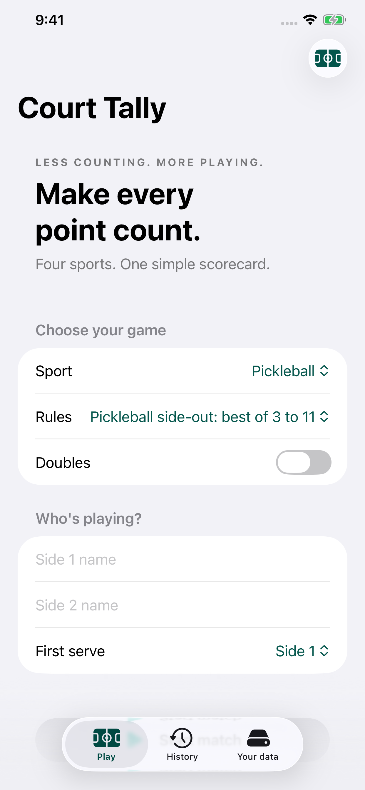
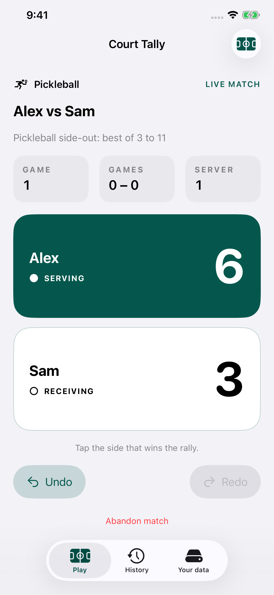
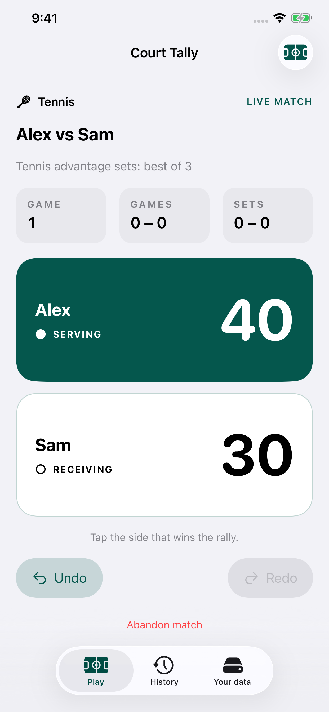
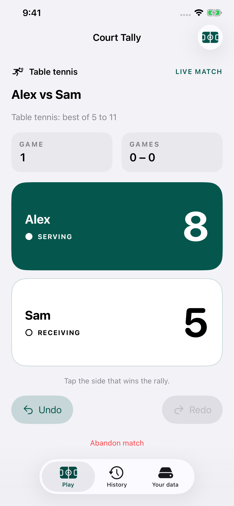
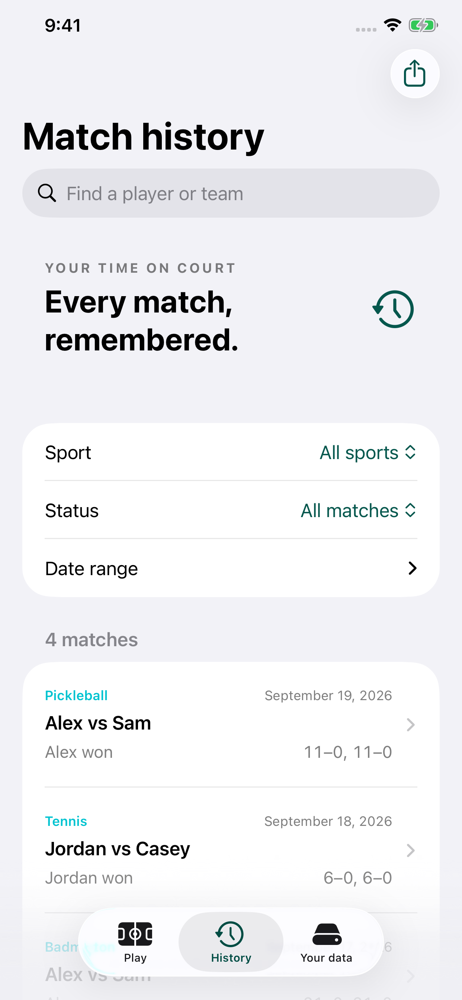
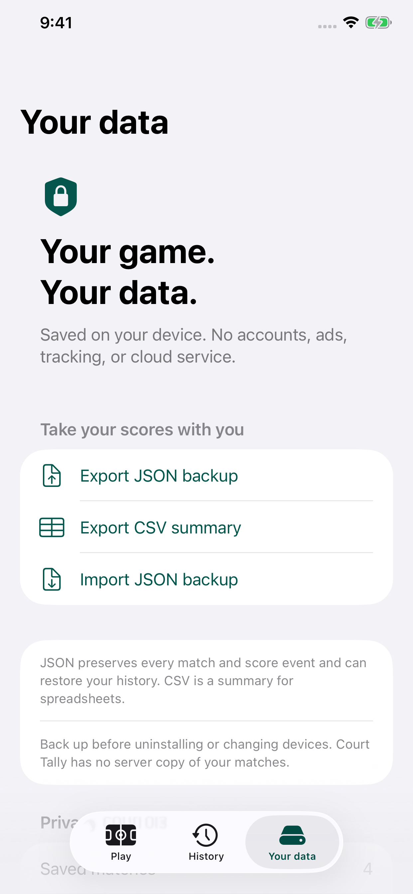

# Native iPhone screenshots

Seven screenshots of the native SwiftUI app, captured on an iPhone 11 Pro Max running iOS Simulator 26.5. Each PNG is **1242 × 2688 pixels**, portrait, for the App Store's 6.5-inch iPhone slot. The screenshots contain fictional demo data and unmodified native app screens.

| Screen | Preview |
|---|---|
| Match setup |  |
| Pickleball |  |
| Tennis |  |
| Badminton |  |
| Table tennis |  |
| History |  |
| Your data |  |

From the repository root, run `bash scripts/capture-screenshots.sh SIMULATOR_UDID` with a 1242 × 2688 simulator. The script builds Debug, installs, launches isolated fixture data, captures each scene, and verifies dimensions. Screenshot launch arguments and demo data are excluded from Release builds.

The supplied icon is in `ios-native/CourtTally/Assets.xcassets/AppIcon.appiconset`. Store copy is in [app-store.md](../app-store.md). See [Apple's accepted screenshot sizes](https://developer.apple.com/help/app-store-connect/reference/app-information/screenshot-specifications). The native target is iPhone-only (device family 1).
